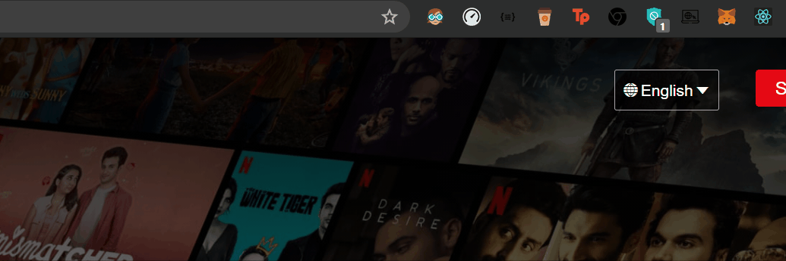
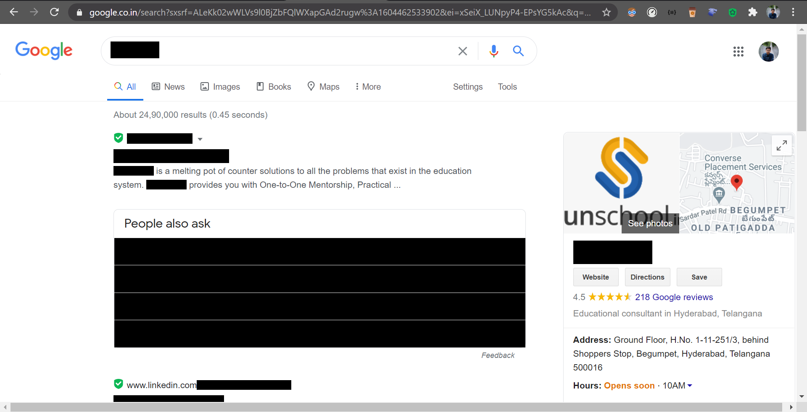

### 

# QuickAccess-Chrome-Extension

   
  

This Google Chrome extension will keep all account links at one place, and will block out some bs on the web.

<strong>version specifics</strong>

**v 2.0.0**

- `Added two modes : Light and Dark`
- `To add spam and redirect blocking using inject scripts`

**v 1.0.0**

- `Basic popup functionality`
- `redirect links`
- `Content blocking for a specific agency`

---

## How To add this extension?

- Clone this repository or download as a zip file.
- Incase you downloaded as a zip, unzip it.
- Open Google Chrome browser.
- Open the `chrome://extensions` page.
- Enable the `Developer` mode.
- Click `Load unpacked extension` option to unpack.
- Select the path where you cloned/downloaded this project.

- You will see the extension displayed on the extensions page, enable the extension.
- The [extension](https://github.com/akashchouhan16/QuickAccess-Chrome-Extension "QuickAccess Extension") is ready to be used. :)

---

## Preview

> 

## Static Preview

<strong>View Images</strong>

 

**Light Mode** 

---

**Dark Mode** 

---

###### Extension **UI** from [Traversy Media](https://www.traversymedia.com/ "Checkout his content").

## About the extension

- Popup extension for Google chrome.
- Preventing url redirects.
- spam blocking `(specific hard-coded links)`
- Content blocking on search results.

---

 <!--  -->

## [Application Info](https://github.com/akashchouhan16/QuickAccess-Chrome-Extension "QuickAccess Extension")

### Version

[2.0.0](https://github.com/akashchouhan16/QuickAccess-Chrome-Extension "Application Version")

### License

[MIT](https://github.com/akashchouhan16/QuickAccess-Chrome-Extension/blob/master/LICENSE "License")
